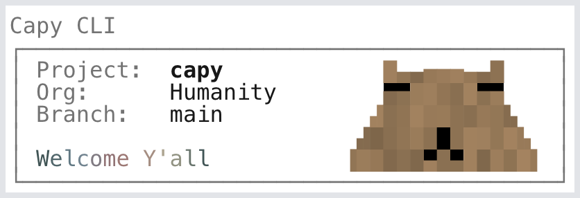
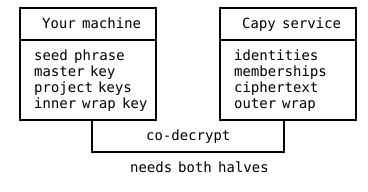
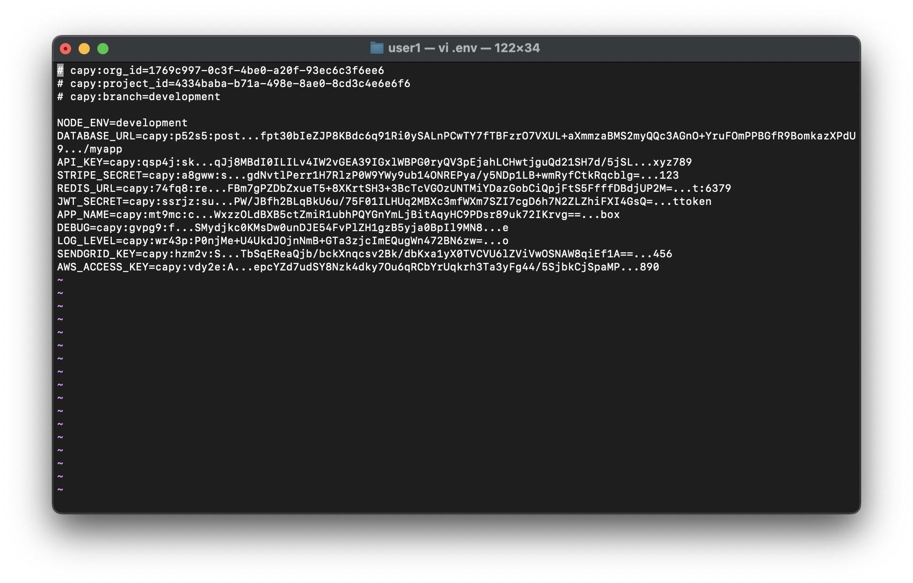

<br />
<br />

<h1 align="center">
  <picture>
    <source media="(prefers-color-scheme: dark)" srcset="./docs/images/logo-dark.svg">
    <source media="(prefers-color-scheme: light)" srcset="./docs/images/logo-light.svg">
    
  </picture>
</h1>

<br />
<br />

<p align="center">
  <strong>Encrypt your <code>.env</code>. Sync it across your team. Ship it anywhere.</strong>
  <br /><br />
  <a href="#install">Install</a>
  ·
  <a href="#quickstart">Quickstart</a>
  ·
  <a href="https://docs.capy.sc">Documentation</a>
  ·
  <a href="https://github.com/capysc/capy-cli/releases">Changelog</a>
  ·
  <a href="https://github.com/capysc/capy-cli/issues">Issues</a>
</p>

<p align="center">
  <a href="https://github.com/capysc/capy-cli/actions/workflows/ci.yml"></a>
  <a href="https://github.com/capysc/capy-cli/actions/workflows/ci.yml"></a>
  <a href="https://www.npmjs.com/package/@capysc/cli"></a>
  <a href="https://nodejs.org"></a>
  <a href="./LICENSE"></a>
</p>

Capy is a headless CLI-based secrets control system that secures your entire stack with one command. Your `.env` is encrypted on your machine and decrypted only at runtime. The architecture is zero-trust: nobody can decrypt the secrets we store (not even us), and agents or attackers can never read what's on your machine.

## Install

Capy in its most basic form is just a CLI: no lengthy signup, account setup, or SDK to import. For more advanced users and functionality, [Keep](https://www.capy.sc/keep) is our managed platform (coming soon).

```bash
npm install -g @capysc/cli
```

Or with Bun:

```bash
bun add -g @capysc/cli
```

Or with Homebrew:

```bash
brew install capysc/tap/capy
```

## Quickstart

```bash
capy                              # sync secrets
capy invite rachael@tyrell.com    # add a teammate
capy kick roy@tyrell.com          # remove a teammate
capy run -- npm run dev           # run with decrypted secrets
capy deploy                       # ship to prod
```

That's the whole loop. Edit a secret, run `capy`, see this guy, redeploy.

<p>
  <picture>
    <source media="(prefers-color-scheme: dark)" srcset="./docs/images/welcome-dark.png">
    <source media="(prefers-color-scheme: light)" srcset="./docs/images/welcome-light.png">
    
  </picture>
</p>


## Why Use Capy

- **Zero-trust storage.** Our service holds ciphertext and membership records. We don't hold your master key, your project keys, or any plaintext.
- **Single CLI for any runtime.** `capy run` injects decrypted values into Node, Python, Go, Ruby, or any process that reads env vars. Your code stays vanilla: just `process.env`.
- **Headless.** No dashboard, daemon, background service, or UI to slow you down.
- **Instant revocation.** `capy kick` takes effect on the next request and the kicked user's local `key.enc` becomes cryptographically inert. Remaining members keep using the same keys.
- **Version control for secrets.** Capy runs alongside git with its own branches and a committed `keep.lock` manifest. Each git branch pins to a Capy branch, so secrets travel with your code.
- **Source Available.** CLI is AGPL-3.0. Code is auditable on GitHub.

## How it works

Capy is a zero-trust secrets manager: we start by encrypting your `.env` on your machine. The encrypted secrets then sync to our service, and your team decrypts them on their own machines. We never see plaintext at any point.

<p align="center">
  <picture>
    <source media="(prefers-color-scheme: dark)" srcset="./docs/images/01-trust-dark.svg">
    <source media="(prefers-color-scheme: light)" srcset="./docs/images/01-trust.svg">
    
  </picture>
</p>

Decryption is a two-party operation: our service strips the outer wrap of your `key.enc`, your machine strips the inner. Neither side has both keys.

For the full threat model, see [docs.capy.sc/internals/zero-trust](https://docs.capy.sc/internals/zero-trust). For the cryptographic constructions, see [docs.capy.sc/internals/cryptography](https://docs.capy.sc/internals/cryptography).

## Encrypt at source

Most secrets managers encrypt at rest on their servers. Capy is one of the few that encrypts at source. Every value in your `.env` is ciphertext on your machine before any of it crosses the wire, making Capy a uniquely zero-trust, end-to-end secrets control system built for humans and agents alike.

<p align="center">
  
</p>

Each value is a `capy:{resourceId}:{ciphertext}` snippet only your team can decrypt, but with just enough characters surrounding the ciphertext for you to identify the items. Plaintext only exists in process memory while `capy run` has your app spawned.

## Commands

| Command | Description |
|---------|-------------|
| [`capy`](https://docs.capy.sc/cli/capy) | Sync secrets. Initializes on first run. |
| [`capy run -- <cmd>`](https://docs.capy.sc/cli/run) | Run a command with decrypted secrets injected. |
| [`capy status`](https://docs.capy.sc/cli/status) | Show drift between local, pinned, and remote. |
| [`capy push`](https://docs.capy.sc/cli/push) | Push local changes without pulling. |
| [`capy deploy`](https://docs.capy.sc/cli/deploy) | Generate a deploy token and walk through platform setup. |
| [`capy invite <email>`](https://docs.capy.sc/cli/invite) | Invite a teammate. |
| [`capy redeem <code>`](https://docs.capy.sc/cli/redeem) | Redeem an invite code. |
| [`capy kick <email>`](https://docs.capy.sc/cli/kick) | Remove a teammate. |
| [`capy users`](https://docs.capy.sc/cli/users) | Interactive member management. |
| [`capy org`](https://docs.capy.sc/cli/org) | List or switch organizations. |
| [`capy branch`](https://docs.capy.sc/cli/branch) | List or switch branches. |
| [`capy checkout <branch>`](https://docs.capy.sc/cli/checkout) | Switch branches. `-b` to create. |
| [`capy grant-branch`](https://docs.capy.sc/cli/grant-branch) | Grant access to a protected branch. |
| [`capy revoke-branch`](https://docs.capy.sc/cli/revoke-branch) | Revoke branch access. |
| [`capy info`](https://docs.capy.sc/cli/info) | Show current session info. |
| [`capy logout`](https://docs.capy.sc/cli/logout) | Clear local session. |
| [`capy cleanup`](https://docs.capy.sc/cli/cleanup) | Remove git hooks and local state. |

## Syncing

`capy` is a three-way diff between your local `.env`, the last pinned snapshot in `keep.lock`, and the latest on the service. Conflicts open an interactive resolver. See [docs.capy.sc/using/syncing-secrets](https://docs.capy.sc/using/syncing-secrets).

## Running your app

`capy run -- <cmd>` decrypts `.env` in memory and spawns your command with the values set as environment variables. Works in any runtime that reads env vars. See [docs.capy.sc/using/running-your-app](https://docs.capy.sc/using/running-your-app).

## Deploying

`capy deploy` walks through Vercel, Cloudflare, Docker, Fly, Railway, Render, Heroku, GitHub Actions, and AWS Lambda. See [docs.capy.sc/using/deploying](https://docs.capy.sc/using/deploying).

## Team

`capy invite <email>` to add a teammate; `capy kick <email>` to remove one. Invite codes travel out-of-band; kicks are O(1) with no key rotation. See [docs.capy.sc/using/team/inviting](https://docs.capy.sc/using/team/inviting).

## Branches

Capy is a version control system for secrets that runs alongside git. You commit code, you sync secrets. Both have branches, both have a committed manifest (`.git/`, `keep.lock`), both pull and push to a remote. The difference: git's remote sees your code, Capy's remote only sees ciphertext.

A **Capy branch** is to your secrets what a git branch is to your code: a parallel state with its own values and its own access list. Switching branches changes which values `capy run` injects. As an example setup, you might keep a `development` branch open to every member while gating a `production` branch to only admins.

Because Capy branches are independent of git branches, each git branch pins to a Capy branch via the committed `keep.lock` file. Branch names are yours to choose, just like in git: a common pattern is sharing one shared dev branch across feature work and pinning `release-*` git branches to a separate staging or production branch.

For the full state model and protected-branch role enforcement, see [docs.capy.sc/using/branches/overview](https://docs.capy.sc/using/branches/overview).

## FAQ

<details>
<summary><strong>What is zero trust?</strong></summary>

Zero-trust is a cryptographic property: an attacker who fully compromises our service still can't decrypt your secrets, because every decryption requires a key share that lives only on your machine. Capy isn't asking you to trust us; the architecture ensures that compromising our service alone yields only ciphertext.
</details>

<details>
<summary><strong>What if I lose my seed phrase?</strong></summary>

If you're the org owner and you lose the seed phrase with no other device holding `key.enc`, you lose access to that org. Capy can't help; it's zero-trust by design, so recovery would require us to hold something we intentionally don't. Back the seed phrase up when it's shown (password manager, physical note in a safe).
</details>

<details>
<summary><strong>How do I migrate from plain dotenv?</strong></summary>

Run `capy` in a project that already has a `.env`. On first run, Capy treats your `.env` as authoritative, encrypts every value, uploads the ciphertext, and rewrites `.env` in place with `capy:...` snippets. A backup of your original `.env` is written to `.env.pre-capy.old` (gitignored).
</details>

<details>
<summary><strong>Does it work offline?</strong></summary>

The first sync needs network for authentication and key co-decrypt, but after that, `capy run` works offline against the local cache at `~/.capy/`. You can develop on a plane; you just can't pick up changes other teammates pushed.
</details>

<details>
<summary><strong>How fast does `capy kick` propagate?</strong></summary>

Immediately. On the kicked user's next request, the service refuses to strip the outer wrap; their `key.enc` becomes cryptographically inert on disk. The master key never rotates because remaining members can keep using it.
</details>

<details>
<summary><strong>Does this meet SOC 2 / GDPR requirements?</strong></summary>

SOC 2 audit is in progress. GDPR-compliant. Trust posture and ongoing reports at [trust.capy.sc](https://trust.capy.sc).
</details>

<details>
<summary><strong>What does Capy cost?</strong></summary>

Free for individuals and small teams. Paid plans for orgs that need higher quotas, more projects, or more members.
</details>

<details>
<summary><strong>Does it support SSO?</strong></summary>

Yes. Configure your identity provider (Okta, Azure AD, Google Workspace, etc.) when creating your organization and your team authenticates via the same provider as the rest of your stack.
</details>

<details>
<summary><strong>Can I self-host?</strong></summary>

Not currently. The service component is closed. If self-hosting matters for your compliance posture, get in touch.
</details>

<details>
<summary><strong>What if capy.sc goes down?</strong></summary>

`capy run` keeps working from the local cache, so your running apps don't break. New syncs pause until the service comes back.
</details>

<details>
<summary><strong>Does it work in CI?</strong></summary>

Yes. `capy deploy` generates `SECRETS_BLOB` and `PROJECT_KEY` to set as CI env vars; `capy run` in your build/test step does the rest. See the GitHub Actions guide at [docs.capy.sc/using/deploying/github-actions](https://docs.capy.sc/using/deploying/github-actions).
</details>

## Supply chain

Capy ships with five runtime dependencies. Each is a load-bearing piece of the CLI; nothing is included for convenience or to save a few lines of code. A small dependency footprint keeps the supply-chain attack surface tight.

| Dependency | Purpose | Status |
|------------|---------|--------|
| [`commander`](https://github.com/tj/commander.js) | CLI argument parsing | ✓ no known vulnerabilities |
| [`dotenv`](https://github.com/motdotla/dotenv) | `.env` file parsing | ✓ no known vulnerabilities |
| [`inquirer`](https://github.com/SBoudrias/Inquirer.js) | Interactive prompts | ✓ no known vulnerabilities |
| [`open`](https://github.com/sindresorhus/open) | OAuth browser launch | ✓ no known vulnerabilities |
| [`proper-lockfile`](https://github.com/moxystudio/node-proper-lockfile) | Atomic file locking | ✓ no known vulnerabilities |

Live audit status and the full transitive dep tree: [github.com/capysc/capy-cli/network/dependencies](https://github.com/capysc/capy-cli/network/dependencies).

## Security

Don't file public GitHub issues or discussions for security vulnerabilities. Those channels are public.

Capy takes security issues seriously. If you've found a vulnerability, email [security@capy.sc](mailto:security@capy.sc) with a description and ideally a way to reproduce it. We'll respond as soon as possible.

This address is for undisclosed vulnerabilities only. Please report security problems to us before disclosing them publicly.

## Contributing

You can fork this repo and create pull requests:

[github.com/capysc/capy-cli](https://github.com/capysc/capy-cli) - [bugs](https://github.com/capysc/capy-cli/issues) and [discussions](https://github.com/capysc/capy-cli/discussions)

## License

AGPL-3.0-only. Copyright © Incentv Technologies Inc.

See [LICENSE](./LICENSE) for the full text.
